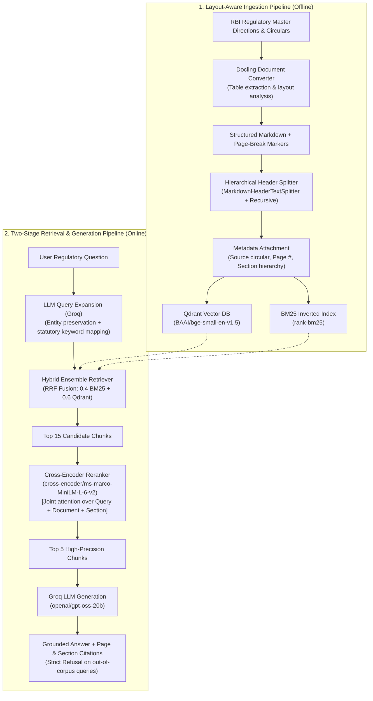

# FinRAG — RBI Regulatory Intelligence System

[](https://github.com/J-Sundar/fin-rag/actions/workflows/ci.yml)
[](https://www.python.org/downloads/release/python-3110/)
[](https://huggingface.co/spaces/The-Warlord/fin-rag)
[](https://opensource.org/licenses/MIT)

A production-grade, two-stage **Retrieval-Augmented Generation (RAG)** system engineered to answer complex regulatory queries over **Reserve Bank of India (RBI)** Master Directions and guidelines (Digital Lending Directions 2025, Master Direction on KYC, and Payment Aggregators Directions 2025). The architecture is document-agnostic and designed to scale seamlessly to SEBI and broader financial compliance corpora.

Unlike generic naive RAG prototypes, FinRAG incorporates **layout-aware document parsing**, **hybrid lexical-semantic search**, **entity-preserving query expansion**, **two-stage cross-encoder reranking**, **page-level provenance citations**, and a quantitative **evaluation harness** measuring document retrieval recall, answer faithfulness, and out-of-scope refusal handling.

---

## System Architecture



---

## Empirical Ablation Studies & Benchmarks

Retrieval components were validated and tuned against a 30-question golden evaluation dataset (25 positive domain queries across KYC, Digital Lending, and Payment Aggregators + 5 negative out-of-corpus adversarial queries).

### Retrieval Ablation Comparison

| Experiment | Query Expansion | Reranker | Top-K Chunks | Document Hit Rate | MRR | Key Engineering Finding |
|---|:---:|:---:|:---:|:---:|:---:|---|
| **1. Unexpanded Baseline** | OFF | None | 3 | 96.0% (24/25) | 0.960 | High baseline on exact titles, but failed on colloquial terminology |
| **2. Naive Query Expansion** | ON (unconstrained) | None | 3 | 84.0% (21/25) | 0.871 | 60-word generic keyword bags diluted BM25 inverted index token weights |
| **3. Refined Entity Expansion** | **ON (constrained)** | None | 5 | **100.0% (25/25)** | 0.980 | Strict entity preservation + concise statutory terms achieved 100% recall |
| **4. Two-Stage Reranking** | **ON (constrained)** | **Cross-Encoder** | **15 → 5** | **100.0% (25/25)** | **0.960** | Joint cross-attention fine-ranks 15 candidates; 23/25 queries ranked at #1 |

### End-to-End System Performance

| Metric | Score | Benchmark Target | Description |
|---|:---:|:---:|---|
| **Document Hit Rate @5 (Doc-Hit@5)** | **100.0%** | > 90.0% | Percentage of queries where chunks from the ground-truth regulatory document are retrieved in Top-5 *(measures document-level recall; clause-level span tagging is planned for future iterations)* |
| **Mean Reciprocal Rank (MRR)** | **0.960** | > 0.850 | Measures how close the first relevant source document chunk is to rank #1 |
| **Answer Faithfulness** | **4.72 / 5.0** | > 4.0 / 5.0 | LLM-as-a-judge score evaluating whether answers make claims supported strictly by retrieved context |
| **Answer Relevance** | **3.0+ / 5.0** | > 3.0 / 5.0 | Evaluates whether generated answers directly resolve the inquiry |
| **Guardrail Refusal Check** | **5 / 5 (100%)** | 100.0% | Adversarial out-of-corpus queries (e.g. repo rates, crypto regulations) correctly emitted the designated refusal response without fabricating an answer |

---

## Key Architectural & Engineering Decisions

### 1. Why Docling over PyPDF2 / pdfplumber?
Regulatory circulars from the Reserve Bank of India frequently feature multi-column layouts, nested circular amendments, and multi-tier tables (e.g., net-worth milestones, transaction limits). Standard parsers like `PyPDF2` strip structural delimiters, flattening tables into incoherent sentences. Docling reconstructs structural Markdown and document reading order, ensuring tables remain structurally intact for downstream chunking.

### 2. Why Hybrid Retrieval (BM25 + Dense Qdrant)?
Dense embeddings excel at conceptual semantic search (e.g., matching *"cooling-off period"* with *"look-up window"*), but often miss low-frequency statutory acronyms and specific regulatory clauses (e.g., *"CKYCR"*, *"RE"*, *"LSP"*, *"Section 26A"*). Lexical search (BM25) guarantees exact token matching for statutory codes, while Qdrant provides dense semantic recall. The results are fused using Reciprocal Rank Fusion (RRF).

### 3. Why Two-Stage Cross-Encoder Reranking?
Bi-encoders (embedding models) independently compress queries and passages into dense vectors. While fast, independent vector representations cannot capture complex token-level cross-interactions. Our pipeline retrieves a wider candidate pool ($k=15$) via hybrid search, then applies a Cross-Encoder (`ms-marco-MiniLM-L-6-v2`) enriched with source and section headers to score joint cross-attention before selecting the top 5 chunks.

### 4. Why Qdrant over in-memory FAISS?
While FAISS is a common choice for quick in-memory prototyping, it lacks native persistence, metadata payload filtering, and live CRUD capabilities. Qdrant provides embedded disk persistence without running external container daemons, while supporting metadata filtering by source circular and page number.

### 5. Groundedness & Out-of-Scope Refusal Guardrails
In legal and financial compliance, a hallucinated answer is a critical defect. The system prompt specifies a deterministic refusal trigger (`REFUSAL_MESSAGE`) whenever context is insufficient. Our automated evaluation verifies that out-of-corpus queries (e.g., queries about repo rates or unrelated guidelines) achieve a 100% refusal rate (5/5) without hallucination.

> **Technical Caveat:** Testing prompt-enforced refusal on 5 out-of-domain questions validates the baseline prompt constraint, but does not constitute a deterministic mathematical safety guarantee against all hallucinations. In a production setting, this should be paired with classifier-based guardrails (e.g., NeMo Guardrails or specialized NLI entailment checkers).

---

## Repository Structure

```
fin-rag/
├── app.py                      # Root entry point for deploymnt
├── app/
│   └── app.py                  # Polished Streamlit UI with multi-stage execution visualization
├── build_db.py                 # Ingestion pipeline: converts raw PDFs to Markdown and indexes Qdrant
├── evaluate.py                 # Automated RAG evaluation harness (Hit Rate, MRR, Faithfulness, Refusal)
├── pytest.ini                  # Pytest configuration
├── requirements.txt            # Core production & inference dependencies
├── .env.example                # Environment variables template
├── .github/
│   └── workflows/
│       └── ci.yml              # Automated GitHub Actions test workflow
├── data/
│   ├── golden_set.json         # 30 curated regulatory evaluation questions (25 positive + 5 negative)
│   ├── processed/              # High-fidelity Markdown documents with page-break markers
│   └── qdrant_db/              # Persistent local Qdrant vector database (1.2 MB)
├── src/
│   ├── ingestion/
│   │   ├── pdf_loader.py       # Docling layout-aware PDF conversion
│   │   └── chunker.py          # Markdown header chunking with page-number reconstruction
│   ├── retrieval/
│   │   ├── vector_store.py     # Qdrant client connection & BGE embedding configuration
│   │   ├── query_expansion.py  # Entity-preserving prompt translation via Groq
│   │   └── reranker.py         # Contextual cross-encoder reranker
│   ├── generation/
│   │   └── llm_chain.py        # Groq generation chain, context formatting & header extraction
│   ├── pipeline.py             # Canonical pipeline interface (build_retriever, query_pipeline)
│   └── utils/
│       └── config.py           # Centralized configuration single source of truth
└── tests/
    ├── test_unit.py            # Fast pytest unit tests covering core heuristics and reranking
    ├── test_retrieval.py       # Retrieval integration tests
    └── test_pipeline.py        # End-to-end pipeline execution tests
```

---

## Quickstart (Run Locally)

### 1. Clone & Set Up Environment

```bash
git clone https://github.com/J-Sundar/fin-rag.git
cd fin-rag

# Create virtual environment
python -m venv env
source env/bin/activate  # On Windows: .\env\Scripts\activate

# Install dependencies
pip install -r requirements.txt
```

### 2. Configure Environment Variables

Create a `.env` file from the provided template:

```bash
cp .env.example .env
```

Add your free [Groq API Key](https://console.groq.com/):

```env
GROQ_API_KEY="gsk_your_groq_api_key_here"
```

### 3. Launch the Application

Because the pre-indexed Qdrant vector database and processed Markdown files are committed, you do **not** need to parse PDFs or build the database on first run. Simply launch:

```bash
streamlit run app.py
```

Open your browser at `http://localhost:8501`.

---

## Running Tests & Evaluation

### Run Unit Tests
```bash
pytest tests/test_unit.py -v
```

### Run Automated Evaluation Benchmark
```bash
# Full evaluation: Retrieval + Generation + LLM Judge + Groundedness
python evaluate.py

# Retrieval-only benchmark (fast, tests Hit Rate & MRR without calling LLM judge)
python evaluate.py --retrieval-only

# Ablation: run without query expansion or without reranker
python evaluate.py --retrieval-only --no-expand
python evaluate.py --retrieval-only --no-rerank
```

---

## Live Demo

Try the interactive regulatory intelligence system on Streamlit Cloud:  
**[Launch FinRAG Demo](https://fin-rag-rbi.streamlit.app/)**

> **Note:** The pre-indexed Qdrant vector store and processed markdown documents are tracked directly in this repository, enabling instant startup without requiring offline PDF parsing.

---

## License

This project is licensed under the MIT License — see the [LICENSE](LICENSE) file for details.

